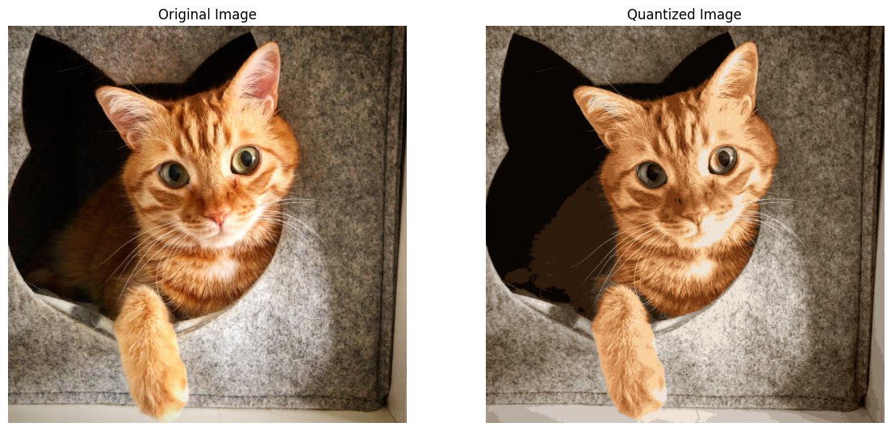

+++
author = "Puja Chaudhury"
title = "Color Quantization"
date = "2023-08-10"
description = "Less is More, Especially with Colors"
image = "intro.png"
+++

Hey there, guys! Today, we’re diving into the captivating world of Color Quantization. Yeah, it might sound like a complex term straight out of a sci-fi novel, but trust me, it's both a crucial and fascinating part of image processing and machine learning. So, stick around to grasp the concept and even try our hand at reducing the number of colors in an image. Let’s get the ball rolling! 🎨

## What the Heck is Color Quantization?

In the simplest terms, color quantization is a method to reduce the number of unique colors in an image while trying to maintain its visual similarity to the original. Why would we do that, we ask? Well, for several good reasons like reducing memory usage, speeding up image processing tasks, or even to apply some retro effects for design or art.

### Applications - Where Can We Use It?

1. **Image Compression**: Smaller palette means less memory. Simple as that.
2. **Real-time Processing**: Think Snapchat filters, folks.
3. **Data Visualization**: Less color distraction equals better interpretation.
4. **Art and Design**: Ah, the vintage look!

## Getting Our Hands Dirty: Code It Up!

Alright, let’s do some real work here. We’re going to use Python and OpenCV to quantize an image. Buckle up!

First off, we'll need to install OpenCV:

```bash
pip install opencv-python
```

Now let's import the necessary modules and read an image.

```python
import cv2
import numpy as np
import matplotlib.pyplot as plt

# Read the image
image = cv2.imread('ging.jpeg')

# OpenCV reads images in BGR format, convert it to RGB for Matplotlib
image_rgb = cv2.cvtColor(image, cv2.COLOR_BGR2RGB)

```

Here’s the actual quantization part. We use the `kmeans` algorithm.

```python
# Reshape the image
pixels = image.reshape((-1, 3))

# Convert to floating point
pixels = np.float32(pixels)

# Define criteria and apply kmeans
criteria = (cv2.TERM_CRITERIA_EPS + cv2.TERM_CRITERIA_MAX_ITER, 100, 0.2)
k = 16
_, labels, centers = cv2.kmeans(pixels, k, None, criteria, 10, cv2.KMEANS_RANDOM_CENTERS)

# Convert back to 8-bit values
centers = np.uint8(centers)

# Map the labels to the centers
segmented_image = centers[labels.flatten()]

# Reshape back to the original image
segmented_image = segmented_image.reshape(image.shape)

# Convert the segmented image back to RGB format for Matplotlib
segmented_image_rgb = cv2.cvtColor(segmented_image, cv2.COLOR_BGR2RGB)
```

Now, let’s see the magic happen!

```python
# Plotting the original and segmented images side by side
plt.figure(figsize=(14, 7))

plt.subplot(1, 2, 1)
plt.title('Original Image')
plt.imshow(image_rgb)
plt.axis('off')

plt.subplot(1, 2, 2)
plt.title('Quantized Image')
plt.imshow(segmented_image_rgb)
plt.axis('off')

plt.show()
```



If we look closely, we'll notice that our ginger cat is now looking somewhat simplified but still retains its essential 'cat-ness'. The colors are fewer, but the image still makes sense, doesn't it? This is the power of color quantization—maintaining the essence of the image while simplifying its color palette. 

## The Under-the-Hood Story

The k-means algorithm is the engine driving our quantization. It clusters similar colors together and replaces them with a single color (the centroid). This way, we reduce the palette but keep the essence of the image.

## Wrap Up and Next Steps

So there we have it, folks. Color quantization is not just a fancy term; it’s a useful tool that’s worth understanding and utilizing. Whether we're building the next killer app or designing awesome graphics, this technique can be our secret sauce.

Feel like diving deeper? Check out more advanced techniques like optimized palette selection or even diving into neural networks for super-advanced color quantization.

That's all for today! Keep hacking and stay curious. Until next time, happy coding! 🚀
