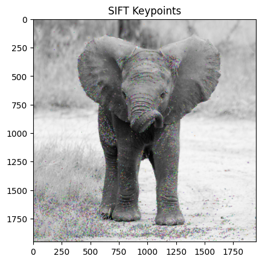
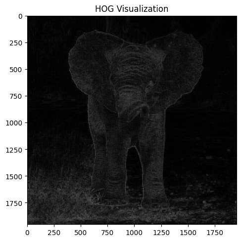

+++
author = "Puja Chaudhury"
title = "Exploring Traditional Object Detection Techniques:"
date = "2023-11-29"
description = "SIFT, HOG, and SVM"
image = "intro.png"
+++

Object detection has always been a cornerstone task in the field of computer vision. Before the advent of deep learning, traditional methods were the go-to solutions for this task. In this blog, we delve into some of these classical techniques, namely Scale-Invariant Feature Transform (SIFT), Histogram of Oriented Gradients (HOG), and Support Vector Machines (SVM), and discuss their applications and limitations.

# What is Feature Extraction?

Feature extraction is the process of defining characteristics of an image that are relevant for solving a computational task, such as object detection. The key is to capture enough information to recognize an object while discarding irrelevant data.


## Scale-Invariant Feature Transform (SIFT)

SIFT, developed by David Lowe in 1999, is a revolutionary feature detection algorithm in computer vision. 

- **Robustness**: It's designed to be invariant to scale and rotation, providing robust matching across different views of an object.
- **Key Stages**: The algorithm involves several key stages, including scale-space extrema detection, keypoint localization, orientation assignment, and keypoint descriptor.
- **Applications**: SIFT was widely used in image stitching, 3D modeling, gesture recognition, and more.

The provided code demonstrates how to implement the Scale-Invariant Feature Transform (SIFT) algorithm in Python using OpenCV. Here's a breakdown of the code:

```python
import cv2
import numpy as np
import matplotlib.pyplot as plt

def sift_feature_detection(image_path):
    # Read the image
    image = cv2.imread(image_path)
    gray = cv2.cvtColor(image, cv2.COLOR_BGR2GRAY)

    # Initialize SIFT detector
    sift = cv2.SIFT_create()

    # Detect keypoints and descriptors
    keypoints, descriptors = sift.detectAndCompute(gray, None)

    # Draw keypoints on the image
    img_with_keypoints = cv2.drawKeypoints(gray, keypoints, image)

    # Display the image with keypoints
    plt.imshow(cv2.cvtColor(img_with_keypoints, cv2.COLOR_BGR2RGB))
    plt.title("SIFT Keypoints")
    plt.show()

    return keypoints, descriptors

# Example usage
keypoints, descriptors = sift_feature_detection("ele.jpg")
```


## Histogram of Oriented Gradients (HOG)

HOG is another feature extraction technique used extensively in object detection.

- **Concept**: It involves counting occurrences of gradient orientation in localized portions of an image.
- **Process**: The image is divided into small connected regions (cells), and for the pixels within each cell, a histogram of gradient directions is compiled.
- **Use Case**: HOG, combined with a linear classifier like SVM, became famous for pedestrian detection.


```python
import cv2
import numpy as np
import matplotlib.pyplot as plt

def hog_feature_extraction_and_visualization(image_path):
    # Read the image
    image = cv2.imread(image_path)
    gray = cv2.cvtColor(image, cv2.COLOR_BGR2GRAY)

    # Initialize HOG descriptor
    hog = cv2.HOGDescriptor()

    # Compute HOG features and locations
    hog_features, hog_image = hog.compute(gray, winStride=(8,8), padding=(0,0), locations=((10,20),))

    # Visualization of HOG features
    plt.figure(figsize=(12, 6))

    plt.subplot(1, 2, 1)
    plt.imshow(cv2.cvtColor(image, cv2.COLOR_BGR2RGB))
    plt.title('Original Image')

    plt.subplot(1, 2, 2)
    plt.imshow(hog_image, cmap='gray')
    plt.title('HOG Visualization')

    plt.show()

    return hog_features

# Example usage
hog_features = hog_feature_extraction_and_visualization("ele.jpg")
```



# The Role of SVM in Object Detection

Support Vector Machine (SVM) is a supervised machine learning algorithm widely used for classification tasks.

- **Functionality**: In object detection, SVM takes the features extracted by methods like SIFT or HOG and learns to classify parts of the image as an object or background.
- **Advantages**: SVM is known for its effectiveness in high-dimensional spaces and its versatility in modeling various types of data.

```python
from skimage import feature, io
import numpy as np
import os

def extract_hog_features(image_path):
    image = io.imread(image_path, as_gray=True)
    hog_features = feature.hog(image)
    return hog_features

# Paths to our dataset folders
object_folder = 'path_to_objects_folder'
background_folder = 'path_to_background_folder'

# Get image file paths
object_images = [os.path.join(object_folder, file) for file in os.listdir(object_folder)]
background_images = [os.path.join(background_folder, file) for file in os.listdir(background_folder)]

# Extract features and create labels
X = [extract_hog_features(image) for image in object_images + background_images]
y = [1] * len(object_images) + [0] * len(background_images)  # 1 for object, 0 for background

# Optionally, split the dataset into training and testing sets
from sklearn.model_selection import train_test_split
X_train, X_test, y_train, y_test = train_test_split(X, y, test_size=0.2, random_state=42)


```

# Limitations of Traditional Methods

While effective in simpler scenarios, these traditional methods faced challenges:

- **Complex Scenes**: They struggled in complex scenes with varying lighting, clutter, and occlusions.
- **Speed**: These methods were often computationally intensive, making real-time detection difficult.
- **Generalization**: Unlike deep learning models, they lacked the ability to generalize well over a wider range of scenarios.

# Conclusion

Traditional object detection techniques, like SIFT, HOG, and SVM, laid the groundwork for modern computer vision. However, the evolution towards deep learning-based methods was driven by the need for more robust, accurate, and faster object detection, especially in complex and dynamic environments.

While these traditional methods have been overshadowed by the advent of deep learning, understanding them is crucial for appreciating the advancements in the field and recognizing the potential for combining classical and modern approaches in future research.