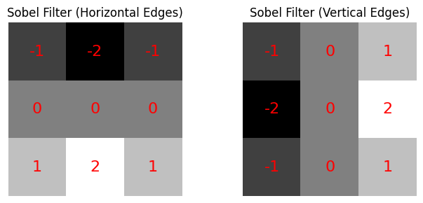
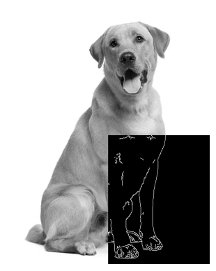
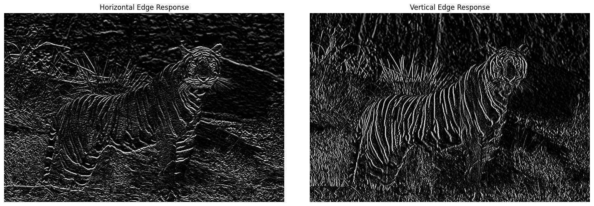
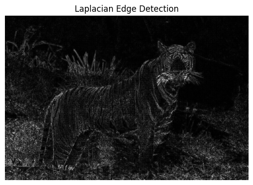
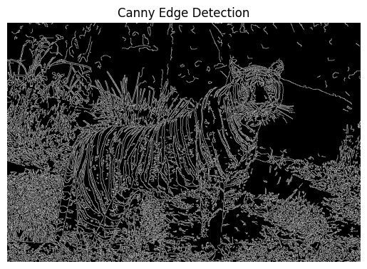

+++
author = "Puja Chaudhury"
title = "Edge Detection"
date = "2023-08-05"
description = "Why Edges Matter"
image = "bg.png"
+++

Edges are the places in an image where pixel values change sharply. These abrupt changes often correspond to the boundaries of objects, shadows, textures, or other significant features in a scene. Detecting these edges is critical for many computer vision tasks such as object detection, image segmentation, and more. 

Understanding edges allows for:
- Improved image comprehension: Helps computer vision algorithms interpret the semantics of a scene.
- Image compression: Edges can be used to compress data while retaining the primary features of an image.
- Image enhancement: Edge detection can be a precursor to tasks like image sharpening.


## Edge Detection as a Filtering Process

When we discuss edge detection, we're really talking about the application of filters to an image. Let's see how that works.

### Filters and Convolution

A filter, often represented as a small matrix (known as a kernel), modifies an image. This modification process is termed as convolution. Convolution is a mathematical operation where we slide the filter over the input image (typically in a 3x3 or 5x5 window) to produce a new image.



In the context of edge detection, this convolution accentuates changes in intensity in the original image, which often correspond to edges.

### How Filters Detect Edges

Consider an image as a 2D signal. In this representation, edges are sudden changes or discontinuities in the signal. Filters designed for edge detection will respond maximally to these rapid changes, while providing minimal response to uniform regions. 



## Sobel Operator

The Sobel operator is one of the earliest edge detection methods. It works by convolving the image with a pair of 3x3 kernels (one for the horizontal gradient and one for the vertical gradient). The magnitude of these two gradients is combined to give the edge intensity at each point.

```python
# Define the 3x3 Sobel filters
sobel_horizontal = np.array([
    [-1, -2, -1],
    [0, 0, 0],
    [1, 2, 1]
])

sobel_vertical = np.array([
    [-1, 0, 1],
    [-2, 0, 2],
    [-1, 0, 1]
])

# Load an image and convert to grayscale
image_path = "tiger.jpeg"
image = cv2.imread(image_path, cv2.IMREAD_GRAYSCALE)

# Convolve the image with the Sobel filters
horizontal_response = cv2.filter2D(image, -1, sobel_horizontal)
vertical_response = cv2.filter2D(image, -1, sobel_vertical)
```

### Mathematical Interpretation
Convolution with these filters involves passing a window over every pixel in the image. For each position of the window:

- The corresponding pixel values of the image under the kernel are multiplied with the kernel values.
- The results are summed up to give a single value.
- The center pixel of the output image for that window position is then assigned this summed value.

### Working of the Sobel operator
**Horizontal Edges** : When a horizontal intensity change (e.g., from a dark region above a light region) is positioned under the horizontal filter, the resulting sum will be a large value, indicating the presence of an edge.

**Vertical Edges**: Conversely, vertical intensity changes produce high values when the vertical filter is applied.

In essence, these filters approximate the gradient of the image intensity at each pixel, giving a measure of edge orientation and magnitude.



## Laplacian Operator

The Laplacian operator detects edges by looking for zero crossings in the second derivative of the image, essentially identifying the places where the intensity of the image changes twice rapidly.

```python
# Load the image in grayscale
image_path = "tiger.jpeg"
img = cv2.imread(image_path, cv2.IMREAD_GRAYSCALE)

# Apply Laplacian filter
laplacian = cv2.Laplacian(img, cv2.CV_64F)
laplacian_abs = cv2.convertScaleAbs(laplacian)  # Convert back to 8-bit
```

### Mathematical Interpretation

The Laplacian of an image \( I \) is defined as:

$$ \[ \nabla^2 I = \frac{\partial^2 I}{\partial x^2} + \frac{\partial^2 I}{\partial y^2} \] $$

This means that the Laplacian at any point in an image is the sum of the second derivatives with respect to the horizontal (x) and vertical (y) directions. 

In discrete image processing, this is usually approximated using a convolution with a 3x3 kernel:
$$
\begin{matrix}
0 & 1 & 0 \\\\
1 & -4 & 1 \\\\
0 & 1 & 0 \\\\
\end{matrix}
$$


### Working of the Laplacian operator

**Intensity Change in Any Direction** : When any form of intensity change, be it horizontal, vertical, or diagonal, is positioned under the Laplacian filter, the resulting sum will be a large value, indicating the presence of an edge.

**Non-Edge Regions**: For uniform regions, where the intensity is consistent, the Laplacian filter will produce values close to zero, indicating the absence of an edge.



In essence, the Laplacian filter captures the second derivative of the image intensity at each pixel, highlighting regions of rapid intensity change, or edges, from all orientations.
The Laplacian operator is sensitive to noise due to the second-order derivative computation. Hence, it's common practice to pre-process images with a Gaussian blur before applying the Laplacian to mitigate noise influence.

## Canny Edge Detection

Developed by John F. Canny in 1986, the Canny edge detector is one of the most popular edge detection methods and often considered the optimal edge detection filter. 

```python
# Load the image in grayscale
image_path = "tiger.jpeg"
img = cv2.imread(image_path, cv2.IMREAD_GRAYSCALE)

# Apply Canny Edge Detection
edges = cv2.Canny(img, 100, 200)  # The values 100 and 200 are the thresholds
```

### Mathematical Interpretation and Working of the Canny Edge Detector

 1. **Noise Reduction**:

Before applying any edge detection, we need to reduce the noise in the image as the edge detection is susceptible to noise in the image. The image is convolved with a Gaussian filter. Mathematically, this convolution is represented as:
$$
\[ I' = I * G \]
$$
where \( I' \) is the smoothed image, \( I \) is the original image, and \( G \) is a Gaussian filter.

 2. **Gradient Calculation**:

To detect the edges, we first need to find the gradient magnitude and direction for each pixel. The gradient of an image \( I' \) at each pixel is a 2D vector with components given by the derivatives in the x and y directions. The gradient magnitude \( M \) and direction \( \Theta \) are computed as:
$$
\[ M(x,y) = \sqrt{(I'_x)^2 + (I'_y)^2} \]
\[ \Theta(x,y) = \arctan\left(\frac{I'_y}{I'_x}\right) \]
$$
Here, \( I'_x \) and \( I'_y \) are the image gradients in the x and y directions, respectively, often computed using the Sobel filters.

 3. **Non-maximum Suppression**:

This step ensures that the detected edges are thin. We traverse all the pixels and set the pixel to zero (non-edge) if its magnitude is not greater than its neighbors in the direction of the gradient. This reduces the thickness of the edges.

 4. **Double Thresholding**:

To determine strong and weak edge pixels, a double threshold approach is applied:

- Strong edge pixels: Pixels with intensity gradient more than an upper threshold.
- Non-edge pixels: Pixels with values less than a lower threshold.
- Weak edge pixels: Pixels with values in between the lower and upper thresholds.

 5. **Edge Tracking by Hysteresis**:

This step ensures that weak edge pixels are either transformed into strong edge pixels or discarded based on their connectivity to strong edge pixels. If a weak edge pixel is connected to strong edge pixels, it's transformed into a strong edge pixel; otherwise, it's discarded (set to zero).

The hysteresis process can be visualized as a connectivity operation where weak edges that have a connection to strong edges are preserved, ensuring continuity in the detected edges.



The Canny Edge Detection algorithm combines various techniques to achieve a robust, accurate, and well-defined edge detection. The sequence of its steps – smoothing, gradient computation, non-maximum suppression, double thresholding, and edge tracking – ensures that it's resistant to noise, provides a clear edge map, and is able to capture true edges in the image.

## Comparison of Edge Detection Filters

| Filter | Pros | Cons |
|--------|------|------|
| **Sobel** | - Effective in detecting vertical and horizontal edges separately. <br> - Less sensitive to noise compared to the Laplacian. | - May not effectively capture diagonal edges unless both filters (horizontal and vertical) are used. <br> - Edges might be thick and might require further processing for thinning. |
| **Laplacian** | - Captures edges from all orientations without the need for multiple filters. <br>  - Produces a single output highlighting rapid intensity changes. | - Very sensitive to noise due to second-order derivative computation. <br> - Can produce double-edge effect where edges appear thicker. |
| **Canny** | - Produces thin, well-defined edges. <br> - Has built-in noise reduction step. <br> - Considers edge directions and magnitudes leading to more accurate edge detection. | - Requires more computation due to multiple stages involved. <br> - Threshold values for edge detection need to be carefully selected for best results. |


## Conclusion

Edge detection is fundamental in computer vision, and understanding the underlying methods provides a robust foundation for more advanced tasks.  Filters are the foundational elements of edge detection. By designing filters that respond maximally to changes in intensity and employing techniques like non-maximum suppression, we can effectively highlight and isolate edges in images. Grasping the filtering process is crucial for understanding the essence of edge detection and, by extension, a multitude of other operations in image processing and computer vision. While the Sobel, Laplacian, and Canny methods are popular, many other techniques are available. The choice of method often depends on the specific application and the nature of the images being processed.
