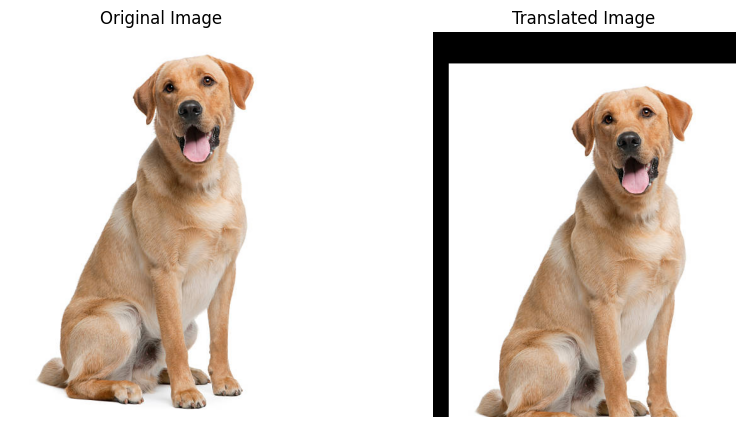
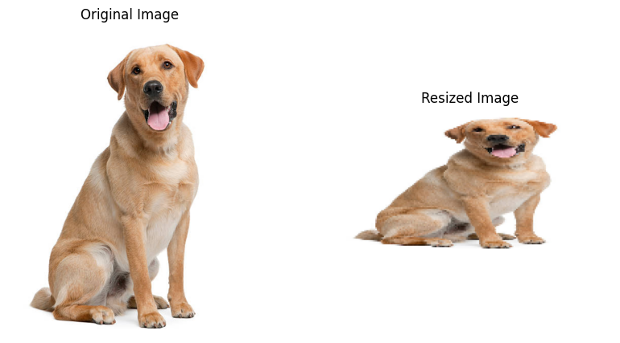
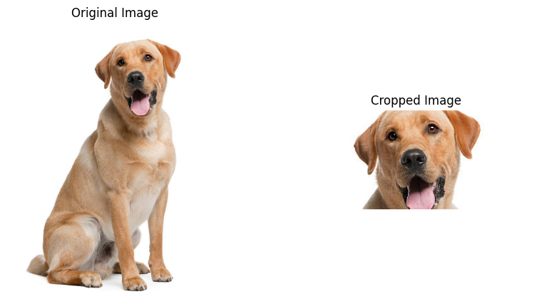
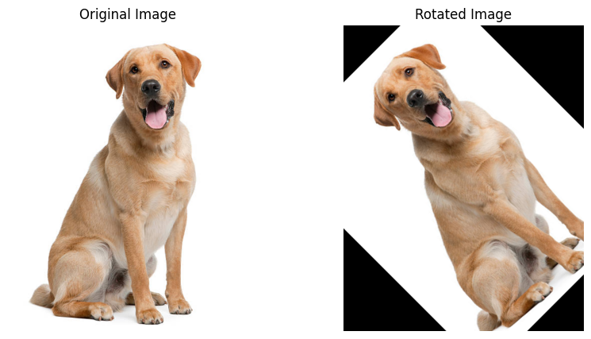

+++
author = "Puja Chaudhury"
title = "Image Manipulation Techniques"
date = "2023-08-04"
description = "Translation, Resizing, Cropping, and Rotating"
image = "bg.png"
+++

Image manipulation is the process of altering or modifying an image to achieve a desired result. With the advent of digital imaging and software technologies like Python's OpenCV, we have gained the power to transform images in almost limitless ways. 

In this article, we will explore some basic yet powerful image manipulation techniques such as translation, resizing, cropping, and rotating.

## Translation

Image translation is a geometric transformation that maps the location of pixels in an image to a new location. In simpler terms, translation means shifting the image in any direction: up, down, left, or right.

In OpenCV, we can translate an image using the `warpAffine()` function, which takes two arguments: 
- the original image 
- and the translation matrix. 

Here's a simple example:

```python
# Define the translation matrix
M = np.float32([[1, 0, 25], [0, 1, 50]]) # Shift 25 pixels right and 50 pixels down

# Apply the translation
translated = cv2.warpAffine(img, M, (img.shape[1], img.shape[0]))
 ```



## Resizing
Resizing is another commonly used image manipulation technique. It changes the size of an image without altering its general shape.

In OpenCV, we can use the resize() function to resize an image. It takes the original image and the desired size as arguments. If we want to maintain the aspect ratio, we can calculate the aspect ratio of the original image and resize accordingly.

```python
# Resize the image
resized = cv2.resize(img, (200, 200)) # New size: 200x200
```


## Cropping
Cropping an image involves selecting a rectangular region inside an image and removing everything outside that region. It can be used to focus on a particular object or area within the image.

Cropping in OpenCV is as simple as using array slicing, since images are represented as NumPy arrays.

```python
# Crop the image
cropped = img[50:200, 100:300] # Rows 50 to 200, columns 100 to 300
```

## Rotating
Rotating an image involves changing the orientation of an image by a certain angle. In OpenCV, we can use the getRotationMatrix2D() function to get a rotation matrix, and then use warpAffine() to apply this matrix.

```python
# Get the rotation matrix
rows, cols = img.shape[:2]
M = cv2.getRotationMatrix2D((cols/2, rows/2), 45, 1) # Rotate 45 degrees around the center of the image

# Rotate the image
rotated = cv2.warpAffine(img, M, (cols, rows))
```


## Conclusion
These are just a few examples of the many image manipulation techniques that are possible using modern imaging libraries like OpenCV. 

Whether we are developing an image processing application, building a computer vision model, or simply experimenting with digital images, these tools provide a powerful way to manipulate and transform our visual data.