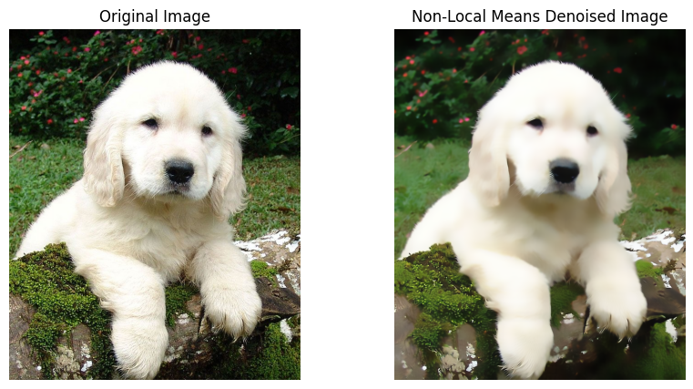

+++
author = "Puja Chaudhury"
title = "Image Filtering"
date = "2023-08-06"
description = "Understanding Filters and Applications"
image = "bg.jpeg"
+++

Image filtering is the process of modifying or enhancing an image by applying a mathematical operation. By using various filters, you can emphasize certain features or remove unwanted noise in the image. This is critical in many image processing tasks, including noise reduction, edge detection, and image smoothing.

# Understanding Image Filters

Filters are generally applied using convolution, similar to edge detection. Different filters emphasize different features in an image, and their design is critical to their function. Two common types of filters are Gaussian and Median filters, each with specific applications.

## Gaussian Filter

The Gaussian filter is one of the most widely used filters in image processing. It is named after the mathematical function that forms the shape of the filter, the Gaussian function.

### How It Works

The Gaussian filter smooths the image by averaging nearby pixels with a Gaussian function. This weighted average considers the distance of pixels from the center, giving more weight to closer pixels. Mathematically, it can be represented as:

$$ \[ G(x, y) = \frac{1}{2\pi\sigma^2} e^{-\frac{x^2 + y^2}{2\sigma^2}} \] $$

Here, sigma is the standard deviation of the distribution, controlling the spread of the filter.

### Application in Python

Using OpenCV, a Gaussian filter can be applied as follows:

```python
# Apply Gaussian filter
gaussian_blurred = cv2.GaussianBlur(image, (5, 5), 0)
```
Here's a breakdown of the components:

- image: The input image to which the Gaussian Blur will be applied.
- (5, 5): This tuple defines the kernel size, specifying the width and height of the Gaussian kernel. In this case, a 5x5 kernel is used, meaning that each pixel will be averaged with its 24 neighboring pixels to calculate the new value.
- 0: This is the standard deviation in the X and Y directions. Setting this value to 0 allows the function to calculate the standard deviation from the kernel size, ensuring an optimal blurring effect without losing too much detail.


The result, gaussian_blurred, will be a new image where the details have been softened by the Gaussian filter, effectively reducing noise and creating a blurred effect. This technique is often used in image processing to smooth out details or to pre-process images for further operations like edge detection.


## Median Filter

The Median filter is another widely used filter, especially for noise reduction. Unlike the Gaussian filter, it doesn't use a mathematical function for weighting.

### How It Works

The Median filter takes a neighborhood around each pixel, sorts the values, and then replaces the pixel with the median of those values. This is particularly effective in removing 'salt-and-pepper' noise, as it preserves edges while removing isolated noise.

### Application in Python

Using OpenCV, you can apply a Median filter like this:

```python
# Apply Median filter
median_blurred = cv2.medianBlur(image, 5)
```

Here's a breakdown of the components:

- image: The input image on which the Median Blur filter will be applied.
- 5: This number specifies the kernel size. In this case, it is set to 5, meaning that a 5x5 window will be used. The Median Blur works by sorting the pixel values within this window and replacing the central pixel with the median value from those sorted values.

The result, median_blurred, is a new image where the details have been softened by the Median filter. Unlike Gaussian Blur, which uses the mean value, Median Blur uses the median, making it particularly effective at preserving edges while reducing "salt-and-pepper" noise. This filter is often used in image processing when you want to reduce noise in an image without blurring the edges too much.


## Bilateral Filter
The Bilateral filter is a non-linear filter that preserves edges while reducing noise by considering both spatial and intensity differences. It smooths pixels that are close in both position and intensity, reducing noise without blurring edges.

### How It Works
The filter considers not only the spatial proximity but also the intensity similarity, making sure that edges are preserved while smoothing the image.

### Application in Python

```python
# Apply Bilateral filter
bilateral_blurred = cv2.bilateralFilter(image, 9, 75, 75)
```

- Source Image: The input image to which the Bilateral filter will be applied.
- Diameter of Pixel Neighborhood: Specifies the size of the neighborhood considered for filtering (9 in this example). The greater the diameter, the more pixels will be included in the calculation.
- Spatial Sigma (75): Controls how close neighboring pixels need to be to influence each other. A higher value means that farther pixels will influence each other more.
- Intensity Sigma (75): Controls how similar the intensities of neighboring pixels must be to influence each other. A higher value means that pixels with more different intensities will influence each other.


## Non-Local Means Filter
The Non-Local Means filter is an algorithm used for image denoising. Unlike "local mean" filters, it averages similar patches from the entire image.

### How It Works
The filter compares all possible patches to all other patches in the image, effectively removing noise.

### Application in Python

```python
from skimage.restoration import denoise_nl_means
# Apply Non-Local Means filter
nlmeans_denoised = denoise_nl_means(image, h=30)
```
- Image Input: Takes a grayscale or color image.
- Parameter h: Filter strength (e.g., 30), controlling smoothing intensity.
- Method: Uses Non-Local Means algorithm, comparing each pixel to all others.
- Output: Returns a denoised image, preserving textures and details.



## Conclusion

In the dynamic field of image processing, filters play an indispensable role in enhancing and modifying images for various applications. Through techniques such as Gaussian, Median, Bilateral, and Non-Local Means filtering, we can achieve diverse effects from noise reduction to edge preservation. Understanding the underlying mechanics of these filters and their implementation in tools like OpenCV and skimage enables both professionals and enthusiasts to craft more precise and effective image processing solutions. 

These methods epitomize the power of mathematical and computational techniques in transforming raw visual data into refined, usable forms, opening doors to countless possibilities in areas like computer vision, digital photography, medical imaging, and more.