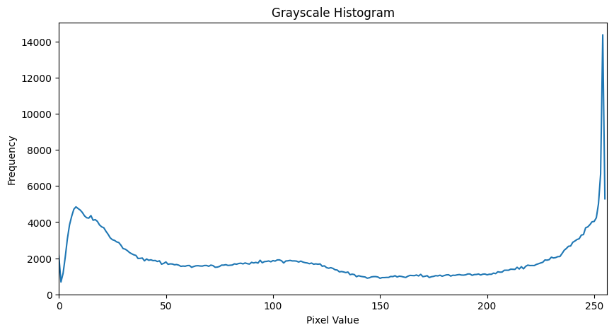
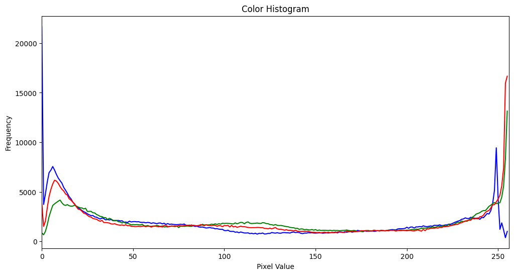
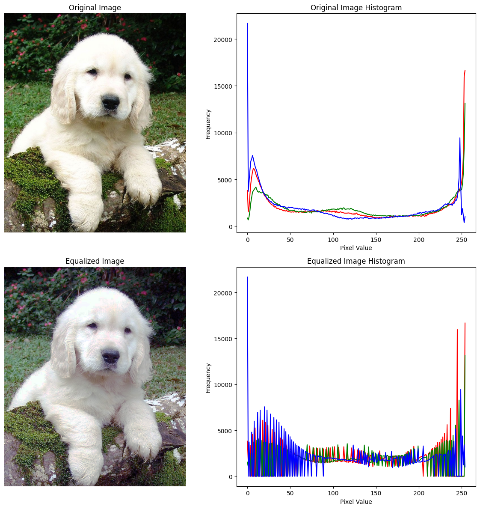

+++
author = "Puja Chaudhury"
title = "Image Histograms"
date = "2023-08-07"
description = "The Secret Sauce of Image Contrast"
image = "intro.jpg"
+++

Hey there! Welcome back to the blog. Today we're diving into the world of image histograms and how they help us improve image contrast. 

**Oh, and a quick heads-up:** From now on, I'm vowing to make these blogs less snooze-worthy and more jam-packed with info you'll actually use. Because let's face it, no one has time for boring, right?


## What the Heck is an Image Histogram?

An image histogram is basically a graphical representation of the tonal distribution in a digital image. Imagine you're a DJ, and each pixel is a different sound frequency—you'd want to know how many times each frequency occurs in your mix, right? An image histogram shows you just that: it tallies up the occurrence of each pixel's intensity value.

Let's break it down:

- X-axis: Represents pixel values (usually ranging from 0 to 255)
- Y-axis: The number of pixels in the image with the corresponding pixel value

A high peak at a certain pixel value? That means a lot of pixels in your image have that intensity. Understanding the histogram helps you grasp the distribution of dark, middle-tone, and bright pixels, and that's crucial for many image processing tasks.

## Black & White vs Color Histograms: What's the Difference?
You might be wondering, why even bother with color histograms when you can get a quick overview with a simple grayscale histogram? Well, there's more than meets the eye, so let's dive in.

### Grayscale Histograms

In a grayscale image, each pixel has a single intensity value, ranging usually from 0 (black) to 255 (white). A grayscale histogram, therefore, represents the distribution of these pixel intensity values across the image. It's the perfect tool for understanding the contrast, brightness, and overall intensity distribution of an image, but it doesn't tell you anything about the colors present.



### Color Histograms

Color histograms, on the other hand, consider the distribution of pixel values across each color channel—usually Red, Green, and Blue (RGB). This means you actually get three separate histograms, one for each channel. Sometimes, these are combined into a single plot for easier comparison.



So what's the advantage? With color histograms, you can grasp the color balance and color distribution in the image, something a grayscale histogram simply can't tell you. This is crucial when you're working on tasks that involve color recognition, color-based filtering, or even just basic image editing to get those Instagram-worthy shots.

### When to Use Which?
Use Grayscale Histograms: When you're interested in the contrast and brightness of the image.

Use Color Histograms: When the color information in the image is important for your task.

Understanding both types of histograms gives you a more rounded perspective on your image data, allowing you to make more informed decisions in your image processing journey.

## How Does This Help Improve Image Contrast?

When all the pixel intensities in your image are similar, it's like listening to a song with a single note playing over and over—monotonous, right? You can't really make out details in the image because there's not much difference in light and dark areas. When pixel intensities are spread out, the contrast is generally better.

By "stretching" the histogram (making sure pixel intensities cover a broad range), we can improve contrast and make the image pop. This is where histogram equalization comes into play.

## Histogram Equalization: The Game Changer

Histogram equalization is the process of redistributing pixel intensities. The goal? To flatten and stretch the histogram so that it's as evenly distributed as possible. This makes the darker areas brighter and the brighter areas, well, properly bright.

Here’s a step-by-step process, assuming you're using Python and OpenCV:

```python
import cv2

# Read the image
image = cv2.imread('image.jpg', 0)

# Apply histogram equalization
equalized_image = cv2.equalizeHist(image)

# Save the result
cv2.imwrite('equalized_image.jpg', equalized_image)
```



## Why Should You Care?
Well, first off, improving image contrast enhances visibility, making it easier for both humans and machine learning algorithms to interpret the image. So, if you're dabbling in machine learning or computer vision, this is a must-know. Plus, if you’re into photography or graphic design, understanding histograms can give you greater control over your digital creations.


## Closing Thoughts
So that's the 101 on image histograms and how they can be a powerful tool for improving image contrast. In the grand scheme of things, this is a pretty basic yet critical concept to understand if you're looking to become proficient in image processing.