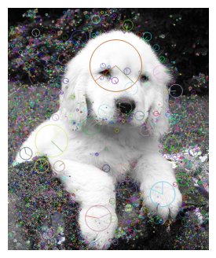
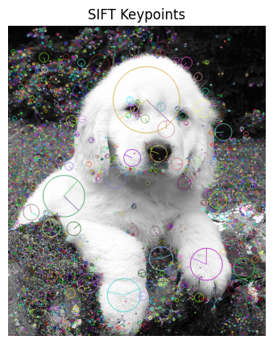
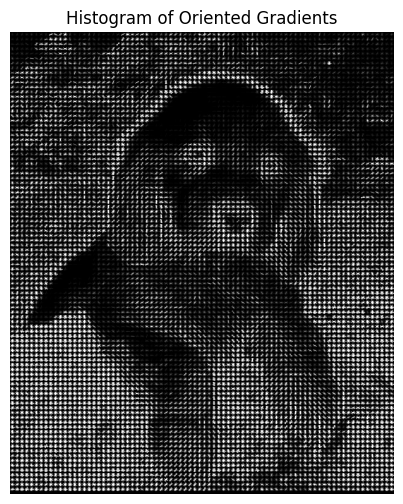

+++
author = "Puja Chaudhury"
title = "Feature Extraction in Images"
date = "2023-08-08"
description = "A Dive into SIFT, SURF, and HOG"
image = "intro.jpg"
+++
## Introduction

Hey folks! Let's talk about something super important in the world of computer vision and machine learning—feature extraction. Ever wondered how your phone's facial recognition system or Snapchat filters know exactly where your face is? That's right—feature extraction techniques help do the magic.

## What are Features?

In simple terms, features are unique points in an image that help us understand its characteristics. Think of them like landmarks; just as you'd use the Statue of Liberty to recognize New York, features help computers recognize patterns in images.


## Why Feature Extraction?

Imagine you're flipping through your vacation photos, and you want to categorize them by location—beach, mountain, city, and so on. Your brain automatically focuses on essential elements like the sea, skyscrapers, or trees to help you categorize these pictures. Feature extraction aims to automate this process, giving computers a way to understand and categorize images effectively.

## Popular Techniques

Let's jump into the good stuff—popular algorithms that make all this possible.

### SIFT (Scale-Invariant Feature Transform)

Developed by David Lowe in 1999, SIFT is a game-changer. It identifies keypoints in images and describes their local appearance. The rad thing about SIFT is its scale-invariance, meaning it'll recognize features whether they're up close or far away.

#### How it Works:
1. **Scale-Space Extrema Detection**: Identifies potential interest points where object features are stable across various scales.
2. **Keypoint Localization**: Removes low-contrast points and edge-like points.
3. **Orientation Assignment**: Assigns orientation based on local image gradients.
4. **Keypoint Descriptor**: Describes keypoints in a way that allows for significant matching.

```python

# Read the image
image = cv2.imread('puppy.jpg', cv2.IMREAD_GRAYSCALE)

# Create a SIFT object
sift = cv2.SIFT_create()

# Detect keypoints and descriptors
keypoints, descriptors = sift.detectAndCompute(image, None)

# Draw the keypoints
image_with_keypoints = cv2.drawKeypoints(image, keypoints, outImage=None, flags=cv2.DRAW_MATCHES_FLAGS_DRAW_RICH_KEYPOINTS)

# Display the results
plt.figure(figsize=(10, 5))
plt.imshow(image_with_keypoints, cmap='gray')
plt.title('SIFT Keypoints')
plt.axis('off')
plt.show()
```


### SURF (Speeded-Up Robust Features)

Think of SURF as SIFT's cooler, faster cousin. Developed by Herbert Bay in 2006, it's all about speed and efficiency while maintaining robustness.

#### How it Works:
1. **Interest Point Detection**: Utilizes an integer approximation of the determinant of the Hessian matrix.
2. **Keypoint Description**: Employs Haar wavelets to describe the area around each keypoint.

```python
# Read the image
image = cv2.imread('puppy.jpg', cv2.IMREAD_GRAYSCALE)

# Create a SURF object
surf = cv2.xfeatures2d.SURF_create()

# Detect keypoints and descriptors
keypoints, descriptors = surf.detectAndCompute(image, None)

# Draw the keypoints
image_with_keypoints = cv2.drawKeypoints(image, keypoints, outImage=None, flags=cv2.DRAW_MATCHES_FLAGS_DRAW_RICH_KEYPOINTS)

# Display the results
plt.figure(figsize=(10, 10))
plt.imshow(image_with_keypoints, cmap='gray')
plt.title('SURF Keypoints')
plt.axis('off')
plt.show()
```
### HOG (Histogram of Oriented Gradients)

Created by Navneet Dalal and Bill Triggs in 2005, HOG focuses on object detection within images. It's pretty popular for pedestrian detection in automotive safety.

#### How it Works:
1. **Gradients Computation**: Calculates gradients in the x and y directions.
2. **Cell Histograms**: Breaks the image into cells and calculates histograms of gradients in these cells.
3. **Block Normalization**: Normalizes cell histograms across larger blocks to counteract lighting changes.

```python
from skimage import feature, exposure
# Read the image in grayscale
image = cv2.imread('puppy.jpg', cv2.IMREAD_GRAYSCALE)

# Initialize HOG descriptor parameters
win_size = (64, 64)
block_size = (16, 16)
block_stride = (8, 8)
cell_size = (8, 8)
nbins = 9

# Compute HOG features using OpenCV
hog = cv2.HOGDescriptor(win_size, block_size, block_stride, cell_size, nbins)
hog_features = hog.compute(image)

# Compute HOG features and visualize using skimage
orientations = 9
pixels_per_cell = (8, 8)
cells_per_block = (2, 2)

hog_features, hog_image = feature.hog(image, orientations=orientations,
                                      pixels_per_cell=pixels_per_cell,
                                      cells_per_block=cells_per_block,
                                      visualize=True)

hog_image_rescaled = exposure.rescale_intensity(hog_image, in_range=(0, 10))

# Show the HOG-processed image
plt.figure(figsize=(10, 6))
plt.imshow(hog_image_rescaled, cmap=plt.cm.gray)
plt.title('Histogram of Oriented Gradients')
plt.axis('off')
plt.show()
```



## When to Use What?

- **SIFT**: Great for object recognition where scale and orientation vary.
- **SURF**: Opt for this when you need speed and can compromise a bit on accuracy.
- **HOG**: Ideal for detecting objects with a well-defined shape (like pedestrians).

## Conclusion

Feature extraction is the unsung hero in the world of machine learning and computer vision. Techniques like SIFT, SURF, and HOG are like the tour guides that help our algorithms navigate the complex landscapes of our images. So, the next time your Snapchat filter lands perfectly on your face, you know what's working behind the scenes.