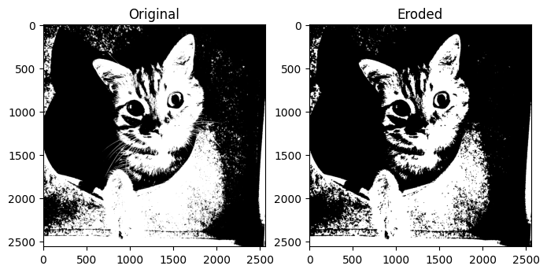
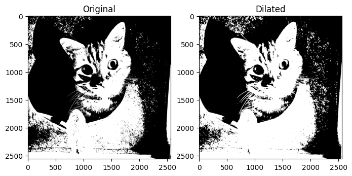
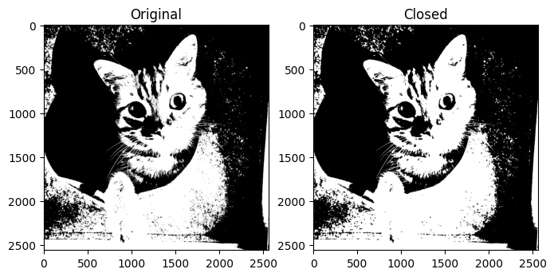
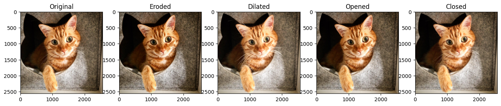

+++
author = "Puja Chaudhury"
title = "Image Morphology"
date = "2023-08-09"
description = "Making Sense of Shapes and Structures"
image = "intro.png"
+++

 Welcome back to our ongoing series on image processing. Today, we're diving into a fascinating topic—Image Morphology. If you've been waiting to unleash the full power of OpenCV for some serious image transformations, buckle up! We're about to morph (see what I did there? 😄) into experts.

## What Is Image Morphology Anyway?

In layman's terms, image morphology is all about understanding and altering the structure and shape within an image. Think of it as the grammar that helps us understand the syntax of objects and shapes in an image. From removing noise and highlighting features to identifying separate objects, morphological operations are game-changers.

### Core Operations: Erosion, Dilation, Opening, Closing

These are the superheroes of the morphological universe:

- **Erosion**: Imagine sandpapering an object down to its core structure. Erosion slims down the edges of white objects (usually foreground). 
- **Dilation**: Opposite of erosion. Picture adding a layer of padding around an object. Helpful for joining broken parts of an object.
- **Opening**: A two-step process that involves erosion followed by dilation. Excellent for removing noise.
- **Closing**: Dilation followed by erosion. Great for closing small holes in objects.


## Digging Deeper: Structuring Elements

## Erosion

Think of erosion like chipping away at a sculpture to reveal its inner form. Technically, what happens is a kernel (usually a square or a circle) scans the image. When any part of the kernel is over a black pixel, the entire area covered by the kernel is set to black in the output image. So essentially, it 'erodes' the edges of bright regions, making them slimmer and removing isolated pixels.

**Mathematically**:  $$
 A \ominus B = \{ z \mid (B)_z \subseteq A \} $$



## Dilation

Dilation is erosion's counterpart. Instead of stripping away the outer layer, imagine inflating a balloon. A kernel scans the image, similar to erosion. Whenever the kernel encounters a white pixel, it changes all the pixels under the kernel to white in the output image, effectively 'growing' the bright regions.

**Mathematically**:  
$$ A \oplus B = \{ a+b \mid a \in A, b \in B \} $$



## Opening

Opening is like a makeover for an image: it cleans up minor imperfections. First, an erosion operation is applied to remove any tiny blemishes (noise). This is followed by dilation, which restores the original size of the object (albeit with blemishes removed).

**Mathematically**:  
$$ A \circ B = (A \ominus B) \oplus B $$


## Closing

If opening is like a makeover, think of closing as reconstructive surgery. It’s excellent for closing up small holes and gaps. Dilation is applied first to pad the object, making it a bit larger and closing small holes. Then, erosion trims it back down to size.

**Mathematically**:  
$$ A \bullet B = (A \oplus B) \ominus B  $$



## Let's Get Coding: OpenCV Ahoy!

Alright, enough talk. Let's code! I assume you've got Python and OpenCV installed. If not, a quick `pip install opencv-python` should set you up.

### Erosion

First off, we need to import our packages.

```python
import cv2
import numpy as np
```

Load an image and define a kernel.

```python
image = cv2.imread('your_image.jpg', 0)
kernel = np.ones((5,5), np.uint8)
```

Now, let's erode!

```python
eroded_image = cv2.erode(image, kernel, iterations=1)
```

### Dilation

Pretty much the same as erosion, just a different function.

```python
dilated_image = cv2.dilate(image, kernel, iterations=1)
```

### Opening

Opening is perfect for noise removal.

```python
opened_image = cv2.morphologyEx(image, cv2.MORPH_OPEN, kernel)
```

### Closing

Lastly, closing is awesome for closing those tiny holes.

```python
closed_image = cv2.morphologyEx(image, cv2.MORPH_CLOSE, kernel)
```



## Putting It All Together

So, how do you decide which operation to use? Honestly, it depends on your project. Erosion is amazing for edge detection, dilation for making an object more pronounced, opening for noise removal, and closing for, well, closing gaps.

## When to Use What: A Guide to Morphological Operations

| Operation | Use Case | Description |
|-----------|----------|-------------|
| Erosion   | Noise Reduction in Foreground | Reduces the size of the foreground object, often used to eliminate noise. |
| Dilation  | Object Enhancement | Expands the size of the foreground object, useful for joining fragmented parts. |
| Opening   | Noise Reduction Overall | Removes noise from the image by eroding and then dilating. Particularly useful for background noise. |
| Closing   | Gap Closing | Closes small holes and gaps in the foreground object by dilating and then eroding. |

Don't be afraid to mix and match these techniques. Sometimes the best results come from a custom chain of operations tailored to your specific needs.

## Wrapping Up

We just scratched the surface of image morphology today, but I hope you're as excited as I am to delve even deeper. You can now tackle a whole new set of image processing problems, armed with erosion, dilation, opening, and closing. So go ahead, give your images the transformation they deserve!

Until next time, happy coding! 🚀
